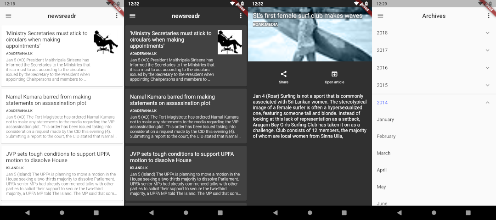

# newsreadr-flutter

A flutter client for the [newsreadr-api](https://github.com/chehanr/newsreadr-api).

Compile the app yourself or download a release build from [here](https://drive.google.com/drive/folders/1655OTxOlAa-T4g2KqL2XghM7hq07cZr7?usp=sharing) and install it.

## Features

- Browse archives.
- Article saving.
- Dark mode.

## TODO

- Implement caching.
- General fixes.
- Add test cases.